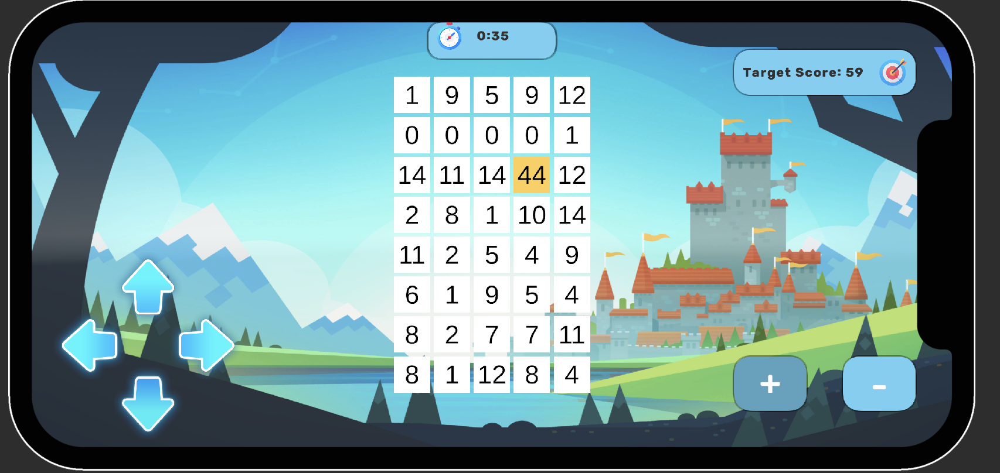
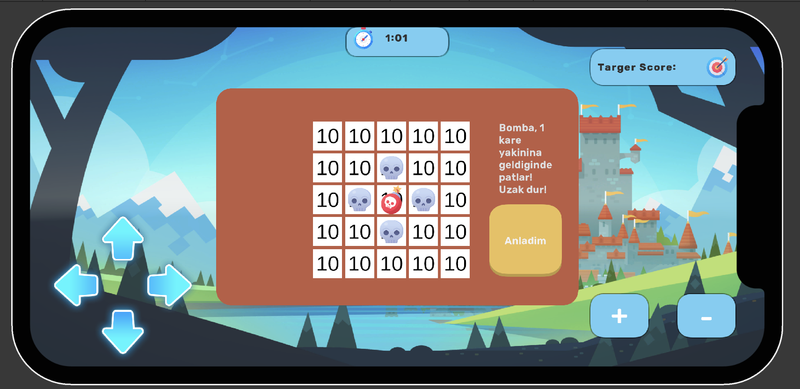
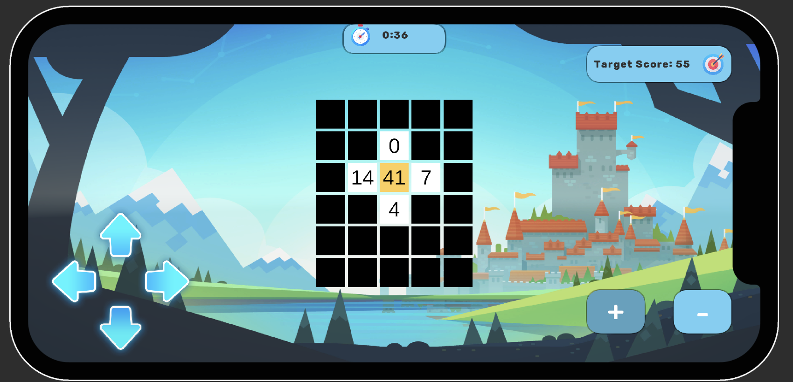

#  GAME-BASED MATHEMATICS EDUCATION WITH 2D AND 3D UNITY PROJECT


As part of this thesis project, a mobile educational game has been developed to enhance children's basic arithmetic skills and problem-solving abilities. The game features a puzzle mechanic where the goal is to reach a target score within a time limit.

The player navigates a grid filled with randomly generated numbers using directional buttons or swipe gestures. At each step, the number in the current cell is either added to or subtracted from the player's score, depending on whether addition or subtraction mode is selected. The main objective is to reach the target score by following the optimal path within the given time.

This structure not only provides basic arithmetic practice but also aims to support cognitive skills such as strategic planning and attention.

## 🎮 Game Mechanics

- The game board consists of a grid filled with randomly generated numbers.
- The player navigates the grid by swiping in four directions.
- The numbers in the cells visited by the player are added to their score.
- The player can select either addition or subtraction mode via the UI on the screen.
- The goal is to reach the target score within a limited number of moves.
- The player wins by following the correct path and reaching the target score before time runs out.

### 🎥 Game Play
[](https://www.youtube.com/watch?v=r17iroOqR-g)


## Software Architecture

The project is built in accordance with **OOP** principles and the **SOLID** software development principles. The codebase is designed to be modular and easily extendable.

### SOLID Principles

- **Single Responsibility**: Each class has only one responsibility. (e.g., `ScoreManager` is solely responsible for score tracking.)
- **Open/Closed**: The code is open for extension but closed for modification. (e.g., different timer managers can be implemented by deriving from `AbstractTimerManager`.)
- **Interface Segregation & Dependency Inversion**: Behaviors are abstracted using interfaces such as `IGameWinCheck`, `INextLevelLoader`, and `ISeaAbleArea`. The `GameManager` operates based on these abstractions.


### 🧩 Event System and EventBus

An **event-driven architecture** is used in the project. The `GameManager` class listens to game events through a central channel called `IEventBus`:
```csharp
_eventBus.Subscribe<TimeUpEvent>(OnTimeUp);

┌────────────────────────────┐
│        IEventBus           │◄────────────────────┐
└────────────────────────────┘                     │
                                                  ▼
                                subscribes/publishes events
                               (TimeUpEvent, PlayerMoveEvent, etc.)

┌────────────────────────────┐
│      IGameWinCheck         │◄────────┐
└────────────────────────────┘         │
                                       ▼
                       ┌────────────────────────────┐
                       │ ScoreBasedWinChecker       │
                       │ - levelLoader              │
                       │ - _eventBus                │
                       │ + CheckWin(...)            │
                       └────────────────────────────┘

┌────────────────────────────┐
│     INextLevelLoader       │◄────────┐
└────────────────────────────┘         │
                                       ▼
                       ┌────────────────────────────┐
                       │ DefaultLevelLoader         │
                       │ + LoadNextLevel()          │
                       │ + ReLoadLevel()            │
                       └────────────────────────────┘

┌────────────────────────────┐
│      ISeaAbleArea          │◄────────┐
└────────────────────────────┘         │
                                       ▼
                       ┌────────────────────────────┐
                       │ BlindModeSeaAbleArea       │
                       │ - tile                     │
                       │ + SeaAble(index)           │
                       └────────────────────────────┘

                 ▲
                 │ inherits
┌──────────────────────────────────────┐
│         BaseGamaManager              │
│--------------------------------------│
│ - Score: int                         │
│ - timeIsUp: bool                     │
│ - _eventBus: IEventBus               │
│ - _winCheck: IGameWinCheck           │
│ - _nextLevelLoader: INextLevelLoader │
│ - _seaAbleArea: ISeaAbleArea         │
│ + Awake(), Start()                   │
└──────────────────────────────────────┘
                 ▲
                 │ inherits
┌──────────────────────────────────────┐
│           GameManager                │
│--------------------------------------│
│ + OnEnable()                         │
│ + UpdateScore(int)                   │
│ + OnTimeUp(TimeUpEvent)              │
│ + NextLevel()                        │
│ + ReGame()                           │
└──────────────────────────────────────┘

```


## 🖼️ Game Images

###  Main Game Screen  


### 💣 Bomba Modu  


### 🧪 Blind Mod Özelliği  


##  Installation & Running

### Prerequisites

-Unity 2022 or later installed

### Steps

1. **Clone the repository:**
    ```bash
   git clone https://github.com/EgeErdemm/smart-counting-game.git
    ``
2. Open the project in **Unity Hub**:
3. Open the FirstScene
4. Press the Play button to start the game.

> **Note:**  
> The following asset folders and their contents are not included in this repository due to their standard Unity Asset Store license restrictions:
> - `Assets/Layer Lab/`
> - `Assets/Layer Lab.meta`
> - `Assets/Kamgam/`
> - `Assets/POLYGONCityCharacters/`
>
> As a result, some visual elements may be missing or incomplete when you run the project for the first time.  
> Please make sure to import these packages manually from the Unity Asset Store if you wish to use the full visual content.

